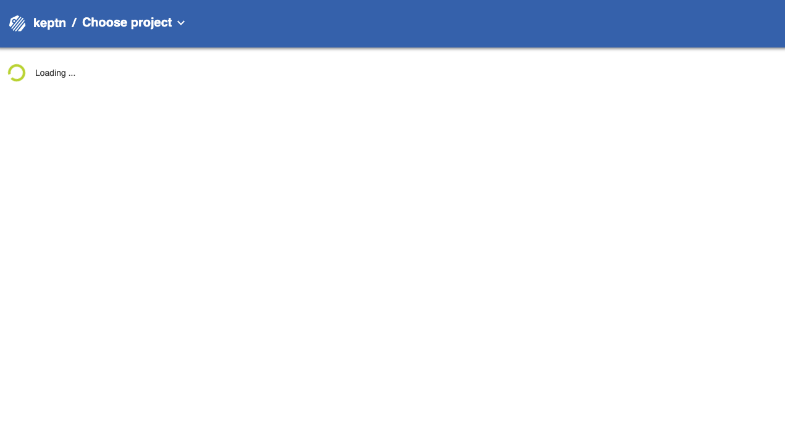

# Keptn Self-Healing Workshop Instructions

# Overview
In this workshop, you will get hands-on experience with the open source framework [Keptn](https://keptn.sh) and see how it can help you to self-healing your applications.
There is no need to install any software on your local machine, instead we will use cloud resources for the course of this workshop.

# Pre-requisites

## 1. Accounts 🎫

* **Dynatrace** - We will use Dynatrace to monitor our cluster as well as all our sample application. You will find the login information on the handout on your place. 
* **Kubernetes Cluster** - A Kubernetes Cluster is provided for you to deploy and run the sample application on. 


## 2. Tools 🛠️

There is no need to install anything on your local machine, instead we are going to use a web browser to connect to our workshop environment.

## 3. Connect to the Workshop Environment

Please find the login information at your place or ask the instructor. Open a web browser and login to the bastion host with the provided credentials.

1. Verify your Kubernetes configuration

    ```console
    kubectl config current-context
    ```
    Should give you something like
    ```
    XXXXXXXXX
    ```
2. Verify that all files are available
    ```console
    ls -la
    ```
    Should give you:
    ```
    XXXXX
    ```

1. Clean up previously installed OneAgent Operator.


    Since in the previous class we already deployed the Dynatrace OneAgent Operator into our cluster, we first remove it to make sure to have a fresh start.

    ```console
    kubectl delete namespace dynatrace
    ```


# Install Keptn ⚙️

## 1) Install Keptn

Install the Keptn control plane components into your cluster, using the **Keptn CLI**:

```console
keptn install --platform=kubernetes
```

Provide the cluster name, region, and project.


Please note that the Keptn install command does offer support for other platforms as well. A list of all supported platforms can be retrieved by executing `keptn install --help` .

The installation will take about **5 minutes** to perform.

<details><summary>Details about this step</summary>

The Keptn CLI will now install all Keptn core components into your cluster, as well authenticating the Keptn CLI at the end of the installation. 

Once the installation is finished you should find a couple of pods running in your keptn namespace.

```console
$ kubectl get pods -n keptn

NAME                                                              READY   STATUS    RESTARTS   AGE
api-79b8ccfd76-qj72x                                              1/1     Running   0          2m1s
bridge-77f6c87848-6pmfz                                           1/1     Running   0          2m1s
configuration-service-6d685d77c6-tnznz                            1/1     Running   0          2m
eventbroker-go-6ffd7c645f-pcx79                                   1/1     Running   0          2m1s
gatekeeper-service-evaluation-done-distributor-59b5c67c4f-5m48g   1/1     Running   0          65s
gatekeeper-service-fb78959f7-9nxbh                                1/1     Running   0          65s
helm-service-56f67c66ff-l2jjp                                     1/1     Running   0          2m1s
helm-service-configuration-change-distributor-7956d55f6-vzfl9     1/1     Running   0          65s
helm-service-service-create-distributor-56dd7867cd-d7vb5          1/1     Running   0          2m
jmeter-service-7b5d4dbd4d-pntfn                                   1/1     Running   0          64s
jmeter-service-deployment-distributor-68449547dd-5kqnf            1/1     Running   0          64s
keptn-nats-cluster-1                                              1/1     Running   0          2m9s
lighthouse-service-7bb5bb6d66-8hfmq                               1/1     Running   0          64s
lighthouse-service-get-sli-done-distributor-6f7cd96bfd-94fbj      1/1     Running   0          64s
lighthouse-service-start-evaluation-distributor-7d7d96f8cfl667x   1/1     Running   0          64s
lighthouse-service-tests-finished-distributor-6bdc9bbf75-p76k8    1/1     Running   0          64s
nats-operator-7dcd546854-f2xvk                                    1/1     Running   0          2m32s
prometheus-service-68dc779f66-g69sw                               1/1     Running   0          36s
prometheus-service-monitoring-configure-distributor-64cd5fw7qvp   1/1     Running   0          19s
prometheus-sli-service-5f56447476-pzn4q                           1/1     Running   0          36s
prometheus-sli-service-monitoring-configure-distributor-7cqcv9t   1/1     Running   0          19s
remediation-service-8f545fb8b-pqgwx                               1/1     Running   0          63s
remediation-service-problem-distributor-545977746-zj22z           1/1     Running   0          63s
servicenow-service-7cd9b8784-4kwmq                                1/1     Running   0          36s
servicenow-service-problem-distributor-699b6c87c9-qn5kv           1/1     Running   0          19s
shipyard-service-649b9ccfdb-jmrmz                                 1/1     Running   0          2m
shipyard-service-create-project-distributor-5654656f66-6fl82      1/1     Running   0          2m
shipyard-service-delete-project-distributor-b4b947b95-cd29h       1/1     Running   0          2m
wait-service-868f65cd8-nm4j4                                      1/1     Running   0          63s
wait-service-deployment-distributor-864779d56b-dx4lk              1/1     Running   0          63s
```

</details>

## 2) Collect tokens for Dynatrace

1. Make sure you have followed the prerequisites and have a Dynatrace tenant ready. If not, please sign up for a [free Dynatrace trial](https://www.dynatrace.com/trial). There is no need to install anything on your local machine. For now, just make sure you have created your tenant.

1. To be able to connect a Dynatrace tenant to the cluster, we will need an API as well as an Platform as a Service (PaaS) token from the Dynatrace tenant.
We recommend creating a temporary file and copying the following lines into an editor, fill them out and keep them as a reference for later:

    ```
    Dynatrace Host Name (e.g. abc12345.live.dynatrace.com):
    Dynatrace API Token:
    Dynatrace PaaS Token:
    ```

1. Login to your Dynatrace tenant and retrieve the tenant ID from the address bar of your browser. Please do copy only the characters between `https://` and the first `/` after the .dynatrace.com. E.g., a valid tenant ID would be abc1234.live.dynatrace.com 

    Copy it to your temporary file to keep it for later.

1. To retrieve the API and PaaS Token, login to your Dynatrace tenant and navigate in the left-hand menu to **Settings -> Integration -> Dyantrace API** and click on **Generate token**. Provide a name, e.g., **keptn-token** and make sure to create a token with the following permissions:
    <details><summary>Open for permissions</summary>
    
    - Access problem and event feed, metrics and topology
    - Access logs
    - Configure maintenance windows
    - Read configuration
    - Write configuration
    - Capture request data
    - Real user monitoring JavaScript tag management
    </details>

    Copy the value of the token into your temporary file.

1. Retrieve the PaaS Token by navigating to **Settings -> Integration ->Platform as a Service** and generate a new token again with a name of your choice, e.g., **keptn-token**. Copy the value to your temporary file to keep it as a reference.


## 3) Install Dynatrace

1. Verify that the OneAgent Operator is not installed yet.

    ```console
    kubectl get namespaces
    ````
    Should give you a list **without** a `dynatrace` namespace. If you still can see the `dynatrace` namespace at this point, please go ahead and remove it: `kubectl delete namespace dynatrace`

1. Create a secret for in your cluster with the Dynatrace credentials

    ```console
    kubectl -n keptn create secret generic dynatrace --from-literal="DT_API_TOKEN=<DT_API_TOKEN>" --from-literal="DT_TENANT=<DT_TENANT>" --from-literal="DT_PAAS_TOKEN=<DT_PAAS_TOKEN>"
    ```

1. Install the Dyntrace service:

    ```console
    kubectl apply -f https://raw.githubusercontent.com/keptn-contrib/dynatrace-service/0.6.0/deploy/manifests/dynatrace-service/dynatrace-service.yaml
    ```

1. Once the Dynatrace service is installed, configure Dyntrace with Keptn:

    ```console
    keptn configure monitoring dynatrace
    ```

## 4) Upgrade & Expose Keptn's Bridge

The [Keptn’s bridge](https://keptn.sh/docs/0.6.0/reference/keptnsbridge/) provides an easy way to browse all events that are sent within Keptn and to filter on a specific Keptn context. When you access the Keptn’s bridge, all Keptn entry points will be listed in the left column. Please note that this list only represents the start of a deployment of a new artifact. Thus, more information on the executed steps can be revealed when you click on one event.

In the default installation of Keptn, the bridge is only accessible via `kubectl port-forward`. To make things easier in this workshop, we will expose it by creating a public URL for this component.

TODO: check if this still correct script!

1. First we update to the latest (still top secret version) of the Keptn's bridge by replacing the previous deployment:

    ```console
    cd bridge/update
    ```

    ```console
    kubectl apply -f newbridge.yaml
    ```

1. Navigate to the folder to expose the bridge.
    ```console
    cd bridge/expose-bridge
    ```

1. Execute the following script.
    ```console
    ./exposeBridge.sh
    ```

1. It will give you the URL of your Bridge at the end of the script. Open a browser and verify the bridge is running.

TODO UPDATE IMAGE
    

# Create project and onboard application

1. Make sure you are in the correct folder of your examples directory:

    ```console
    cd examples/onboarding-carts
    ```

1. Create a project

    ```console
    keptn create project sockshop --shipyard=./shipyard.yaml
    ```

1. Onboard carts service

    ```console
    keptn onboard service carts --project=sockshop --chart=./carts
    ```

1. Onboard the database needed for the carts service

    ```console
    keptn onboard service carts-db --project=sockshop --chart=./carts-db --deployment-strategy=direct
    ```

1. Deploy the carts database

    ```console
    keptn send event new-artifact --project=sockshop --service=carts-db --image=mongo:4.2.2
    ```

1. Deploy the carts service by specifying the built artifact, which is stored on DockerHub and tagged with version 0.10.1:

    ```console
    keptn send event new-artifact --project=sockshop --service=carts --image=docker.io/keptnexamples/carts --tag=0.10.1
    ```

1. Go to Keptn's bridge and check which events have already been generated. You can access it by getting the URL with this command:

    ```console
    echo http://bridge.keptn.$(kubectl get cm keptn-domain -n keptn -o=jsonpath='{.data.app_domain}')
    ```

1. Take a look at the service that has been deployed, by getting the URL with this command:

    * Hardening environment
        ```console
        echo http://carts.sockshop-hardening.$(kubectl get cm keptn-domain -n keptn -o=jsonpath='{.data.app_domain}')
        ```

    * Production environment
        ```console
        echo http://carts.sockshop-production.$(kubectl get cm keptn-domain -n keptn -o=jsonpath='{.data.app_domain}')
        ```

# Create Unleash server

To quickly get an Unleash server up and running with Keptn, follow these instructions:

1. Make sure you are in the correct folder of your examples directory:

    ```console
    cd examples/unleash-server
    ```

1. Create a new project

    ```console
    keptn create project unleash --shipyard=./shipyard.yaml
    ```

1. Onboard unleash and unleash-db using the keptn onboard service command:

    ```console
    keptn onboard service unleash-db --project=unleash --chart=./unleash-db
    keptn onboard service unleash --project=unleash --chart=./unleash
    ```

1. Send new artifacts for unleash and unleash-db using the keptn send new-artifact command:

    ```console
    keptn send event new-artifact --project=unleash --service=unleash-db --image=postgres:10.4
    keptn send event new-artifact --project=unleash --service=unleash --image=docker.io/keptnexamples/unleash:1.0.0
    ```

Get the url (unleash.unleash-production.KEPTN_DOMAIN):
```console
echo http://unleash.unleash-production.$(kubectl get cm keptn-domain -n keptn -o=jsonpath='{.data.app_domain}')
```
Open the url in your browser and log in using the following credentials:
```
username: keptn
password: keptn
```

# Configure Unleash server

Feature flag for a promotional campaign that can be enabled whenever you want to run a promotional campaign on top of your shopping cart

To set up the feature flag, go to your Unleash server and login with the credentials from the previous step.

1. Click on the red `+` to add a new feature flag.
    
1. Name the feature toggle **EnablePromotion** and add **carts** in the description field.
    

## Configure Keptn

Now everything is set up in the Unleash server. For Keptn to be able to connect to the Unleash server, we have to add a secret with the Unleash API URL as well as the Unleash tokens.

Execute the following command but replace $URL with the actual URL, $USER with the user and $TOKEN with the token of your Unleash server. As you have already onboarded unleash using Keptn, you can use the following command:
```console
kubectl -n keptn create secret generic unleash --from-literal="UNLEASH_SERVER_URL=http://unleash.unleash-production/api" --from-literal="UNLEASH_USER=keptn" --from-literal="UNLEASH_TOKEN=keptn"
```

Keptn has to be aware of the new secret and have to load it for it to connect to the Unleash server to set the feature toggles. Therefore, the remediation service must be restarted:

```console
kubectl delete pod -l=run=remediation-service -n keptn
```

Finally, switch to the carts example (cd examples/onboarding-carts) and add the following remediation instructions
```yaml
 remediations:
 - name: "Failure rate increase"
   actions:
   - action: featuretoggle
     value: EnablePromotion:off
```
using the command:

```console
keptn add-resource --project=sockshop --service=carts --stage=production --resource=remediation.yaml --resourceUri=remediation.yaml
```


Now that everything is set up, next we are going to hit the application with some load and toggle the feature flag.


# Try the Self-Healing 👩‍💻👨‍💻

1. Move to the folder with some load generation scripts

    ```console
    cd load-generation/bin
    ```

1. Start the load generator

    ```console
    ./loadgenerator-linux "http://carts.sockshop-production.$(kubectl get cm keptn-domain -n keptn -o=jsonpath='{.data.app_domain}')" 
    ```

1. Now, go back to your Unleash server in your browser. In this tutorial, we are going to turn on the promotional campaign, which purpose is to add promotional gifts to about 30 % of the user interactions that put items in their shopping cart.

1. Click on the toggle next to EnablePromotion to enable this feature flag.
    

1. By enabling this feature flag, a not implemented function is called resulting in a NotImplementedFunction error in the source code and a failed response. After a couple of minutes, the monitoring tool will detect an increase in the failure rate and will send out a problem notification to Keptn.

6. Keptn will receive the problem notification/alert and look for a remediation action that matches this problem. Since we have added the remediation.yaml before, Keptn will find a remediation action and will trigger the corresponding action that will disable the feature flag.


# Keptn Community 📢

Join the Keptn community!

Further information about Keptn you can find on the [keptn.sh](keptn.sh) website. Keptn itself lives on [GitHub](https://github.com/keptn/keptn).

**Feel free to contribute or reach out to the Keptn team using a channel provided [here](https://github.com/keptn/community)**.

Join our Slack channel!

The easiest way to get in contact with Keptn users and creaters is to [join our Slack channel](https://join.slack.com/t/keptn/shared_invite/enQtNTUxMTQ1MzgzMzUxLTcxMzE0OWU1YzU5YjY3NjFhYTJlZTNjOTZjY2EwYzQyYWRkZThhY2I3ZDMzN2MzOThkZjIzOTdhOGViMDNiMzI) - we are happy to meet you there!
